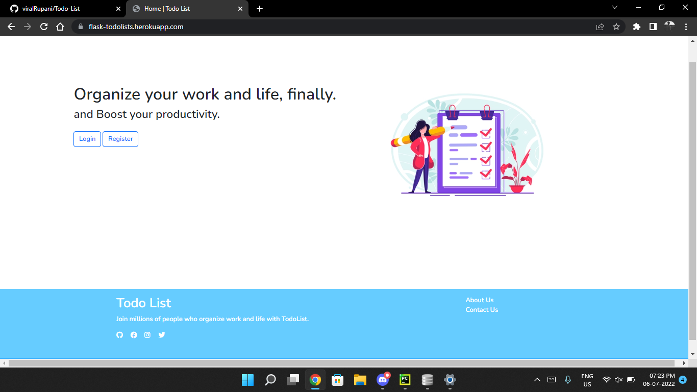
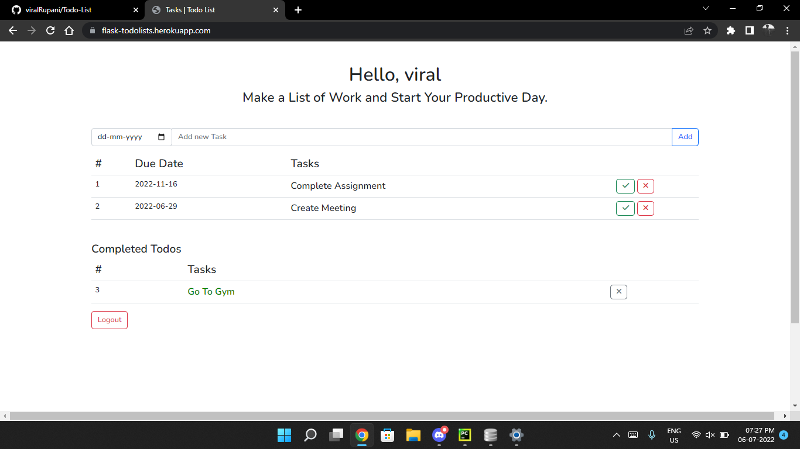

# Todo List
Lots of task management systems and to-do apps exist but they tend to be bloated with features, require a lengthy signup/onboarding process and then they spam you with email. Hi I am Viral Rupani from Gujarat, India. I made this UI/UX and Backend(Flask) during my Learnings, I Tried to make it as uncomplicated as possible and effective for more Productivity.

```commandline
Checkout Here: https://flask-todolists.herokuapp.com/
```
## Screenshots


<hr>
